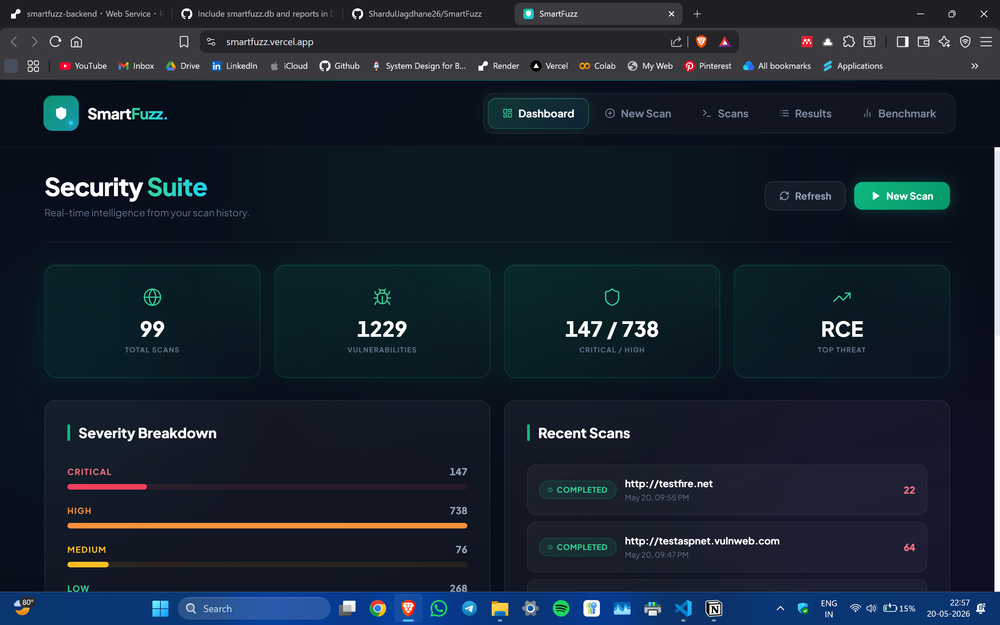
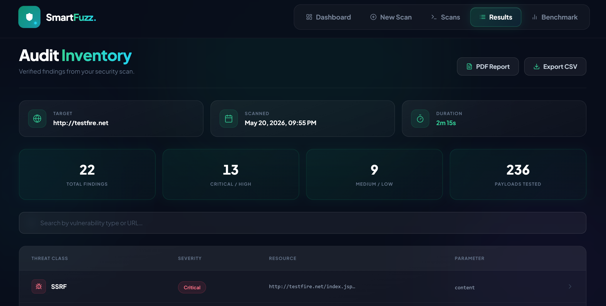
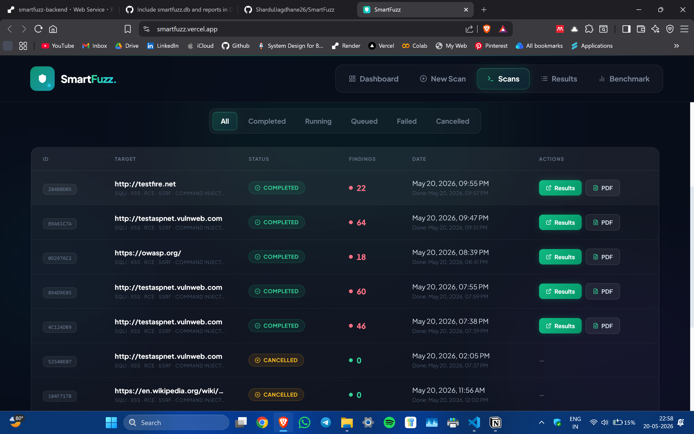
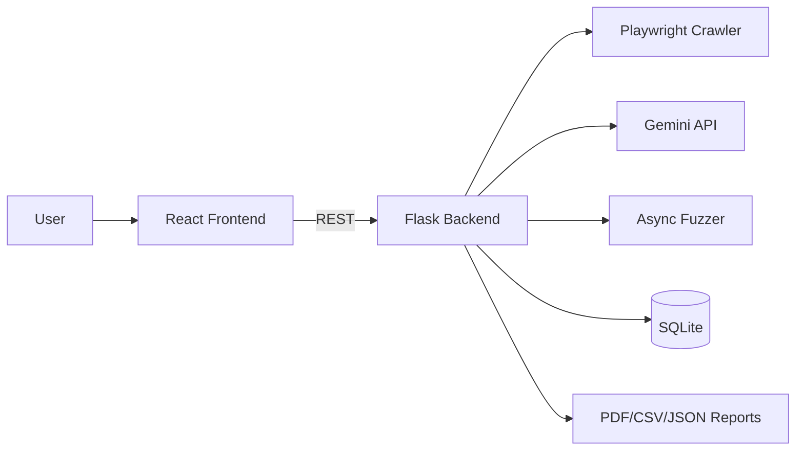

# SmartFuzz

> AI powered web vulnerability fuzzer with differential analysis, Gemini synthesised payloads, and CVSS scored findings.

[](https://www.python.org/downloads/)
[](https://react.dev/)
[](https://flask.palletsprojects.com/)

---







---

## What is SmartFuzz

<p align="justify">SmartFuzz is an AI-augmented web application security scanner that combines a Playwright driven crawler, an async differential fuzzer, and Google Gemini for context aware payload synthesis. Where traditional fuzzers blast fixed payload lists at every endpoint, SmartFuzz crawls the target first to understand its forms, fields, and parameter names, then asks Gemini to generate attack vectors tailored to that specific surface. Each request is compared against a method correct baseline so false positives from reflected query strings and stock 404 pages are filtered out before they ever reach the report.</p>

<p align="justify">After the first pass, SmartFuzz feeds the confirmed findings back into Gemini for a second-pass refinement, the adaptive feedback loop generates more sophisticated variants, WAF-bypass encodings, and deeper exploitation attempts targeted at the parameters that already cracked. When Gemini is rate-limited, the loop falls back to deterministic payload mutations so the second pass always runs. Every finding gets a CVSS v3.1 base score and vector, an OWASP Top 10 (2021) category, and a tailored remediation snippet. The current release supports eleven vulnerability classes: SQLi, XSS, RCE, SSRF, Command Injection, Auth Bypass, IDOR, NoSQL injection, XXE, SSTI, and Open Redirect.</p>

---

## Features

| Capability                  | What it does                                                                                  |
| --------------------------- | --------------------------------------------------------------------------------------------- |
| SQL Injection (SQLi)        | Error-based, boolean-based, and time-based detection with method-correct baselines            |
| Cross-Site Scripting (XSS)  | Signature-driven plus dynamic reflection check on response body                               |
| Remote Code Execution (RCE) | `/etc/passwd`, `id`, Windows directory output, and PHP source disclosure signatures           |
| SSRF                        | AWS / GCP metadata-IP fingerprinting + reflected-IP detection                                 |
| Command Injection           | Shell-operator probes against form and GET parameters                                         |
| Auth Bypass                 | SQL bypass payloads, default credentials, `alg:none` JWTs, header injection                   |
| IDOR                        | Numeric-ID enumeration with response-similarity diffing                                       |
| NoSQL Injection             | MongoDB operator probes (`$ne`, `$gt`, `$where`, `$regex`) + login bypass detection           |
| XXE                         | File-read, OOB, billion-laughs, and `php://filter` payloads against XML endpoints             |
| SSTI                        | Engine-fingerprint math probes plus sandbox-escape and RCE attempts                           |
| Open Redirect               | No-follow request inspection of `Location` headers for attacker-domain leaks                  |
| AI payload synthesis        | Per-field, per-class prompts to Gemini 2.5 Flash-Lite with WAF-bypass guidance                |
| Adaptive second pass        | Confirmed findings are fed back to Gemini for sophisticated variants; mutates statically if rate-limited |
| CVSS v3.1 scoring           | Every finding tagged with a base score and vector via the `cvss` library                      |
| OWASP Top 10 mapping        | Each finding categorised against OWASP 2021 (A01, A03, A05, A07, A10); Dashboard shows live coverage |
| Live progress (WebSocket)   | Real-time scan progress pushed to the LiveScan page via Socket.IO                             |
| Authenticated scanning      | Cookie injection, custom headers, or Playwright form-fill login flows                         |
| SSRF guard                  | Rejects targets that resolve to private / loopback / link-local / cloud-metadata IPs          |
| Legal consent gate          | Modal documents operator consent under IT Act 2000 §43/66 before any scan starts              |
| PDF / CSV reports           | Audit-ready exports with severity breakdown, CVSS scoring, and per-class remediation          |

---

## Quick start (Docker)

```powershell
git clone https://github.com/<you>/smartfuzz.git
cd smartfuzz
copy backend\.env.example backend\.env   # then edit and set GEMINI_API_KEY
docker compose up --build
```

<p align="justify">Open <a href="http://localhost:3000">http://localhost:3000</a> — the backend is proxied at <code>/api/*</code>.</p>

---

## Manual setup

### Backend

```powershell
cd backend
python -m venv .venv
.venv\Scripts\Activate.ps1
pip install -r requirements.txt
playwright install chromium
$env:GEMINI_API_KEY = "your-key-here"
python app.py
```

<p align="justify">The backend serves on <code>http://localhost:5000</code>. Set <code>FLASK_DEBUG=1</code> for hot-reload during development.</p>

### Frontend

```powershell
cd frontend
npm install
npm run dev
```

<p align="justify">The frontend serves on <code>http://localhost:5173</code> by default and talks to the backend on <code>5000</code>.</p>

---

## Architecture



---

## Tech stack

- **Backend** — Python 3.10+, Flask 3, flask-socketio, aiohttp, Playwright (Chromium), SQLite, ReportLab, cvss
- **Frontend** — React 19, TypeScript, Vite, Tailwind CSS, lucide-react, socket.io-client
- **AI** — Google Gemini 2.5 Flash-Lite (`generateContent` with `responseMimeType: application/json`); model is swappable via the `GEMINI_MODEL` env var
- **Persistence** — SQLite via the standard library (`smartfuzz.db`), with `ALTER TABLE` column migrations
- **Production server** — `socketio.run` with eventlet for WebSocket support

---

## API reference

| Method | Endpoint                          | Description                                                            |
| ------ | --------------------------------- | ---------------------------------------------------------------------- |
| GET    | `/api/health`                     | Liveness probe — returns `{"status": "ok"}`                            |
| POST   | `/api/scan/new`                   | Start a new scan; body is `{target_url, scan_type, vuln_classes, auth?}` |
| GET    | `/api/scan/<scan_id>/status`      | Poll scan progress, current step, findings counter                     |
| GET    | `/api/scan/<scan_id>/results`     | Final findings + stats for a completed scan                            |
| POST   | `/api/scan/<scan_id>/cancel`      | Request graceful cancellation of a running scan                        |
| GET    | `/api/scans`                      | List all scans, newest first                                           |
| GET    | `/api/dashboard/stats`            | Aggregate stats across all scans for the Dashboard                     |
| GET    | `/api/reports`                    | List of generated PDF reports                                          |
| GET    | `/api/report/<scan_id>/pdf`       | Download / regenerate the PDF report for a scan                        |
| GET    | `/api/benchmark`                  | Top-level metrics for the Benchmark page                               |

<p align="justify">A WebSocket channel at the same origin emits <code>scan_progress</code> events; clients join the room named after <code>scan_id</code>.</p>

---

## Configuration

| Variable                 | Required | Default                  | Purpose                                                                                |
| ------------------------ | -------- | ------------------------ | -------------------------------------------------------------------------------------- |
| `GEMINI_API_KEY`         | yes      |  —                       | Google AI Studio key used for payload synthesis and second-pass refinement             |
| `GEMINI_MODEL`           | no       | `gemini-2.5-flash-lite`  | Swap to any free Gemini model (`gemini-2.0-flash`, `gemini-1.5-flash-8b`, …)            |
| `SMARTFUZZ_ALLOW_LOCAL`  | no       | `0`                      | Set to `1` to allow scans against `localhost` / RFC1918 (for local DVWA, Juice Shop)   |
| `PORT`                   | no       | `5000`                   | Backend listen port                                                                    |
| `FLASK_DEBUG`            | no       | `0`                      | Set to `1` for the dev server with auto-reload                                         |

<p align="justify">The frontend reads <code>VITE_API_BASE_URL</code> at build time; leave it unset for local development.</p>

---

## Legal & disclaimer

<p align="justify"><strong>Do not run SmartFuzz against systems you do not own or have explicit written authorisation to test.</strong></p>

<p align="justify">Active vulnerability scanning of third-party systems is a criminal offence under the Information Technology Act, 2000 (India), §43 (penalty for damage to computer, computer system, etc.) and §66 (computer-related offences), and under comparable laws in most jurisdictions — including the Computer Fraud and Abuse Act (United States), the Computer Misuse Act 1990 (United Kingdom), and the Council of Europe Convention on Cybercrime.</p>

<p align="justify">SmartFuzz includes a pre-scan consent modal that documents operator authorisation; the SSRF guard further blocks scans targeting private and cloud-metadata IPs by default. These mechanisms do not absolve the operator of legal responsibility. The authors accept no liability for misuse of this software.</p>

---

## Team

SmartFuzz was built by:

| | Name |
|---|---|
| <a href="https://github.com/Nazish0508"></a> | [Nazish Ansari](https://github.com/Nazish0508) |
| <a href="https://github.com/suhani-90"></a> | [Suhani Parkhi](https://github.com/suhani-90) |
| <a href="https://github.com/SejalBhole"></a> | [Sejal Bhole](https://github.com/SejalBhole) |
| <a href="https://github.com/ShardulJagdhane26"></a> | [Shardul Jagdhane](https://github.com/ShardulJagdhane26) |

---
